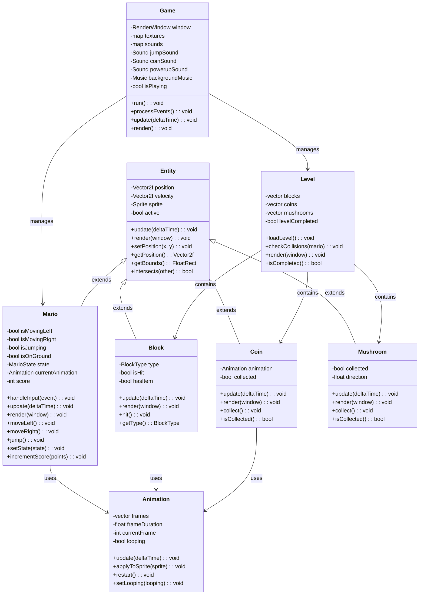

# Super Mario Clone

A 2D Mario-style platformer game implemented in C++ using SFML.

## Requirements Met

| Requirement | Description | Status | Percentage |
|------------|-------------|--------|------------|
| Mario Movement | Mario can run on a flat level | ✅ Completed | 10% |
| Jumping | Mario can jump on a flat level | ✅ Completed | 10% |
| Level Design | Mario can run and jump within an actual level | ✅ Completed | 10% |
| Coin Collection | Mario can pick up coins | ✅ Completed | 5% |
| Animations | Mario has running, jumping, and idle animations | ✅ Completed | 5% |
| Block Destruction | Mario can destroy blocks | ✅ Completed | 10% |
| Power-ups | Blocks can give mushrooms that make Mario big | ✅ Completed | 10% |
| Audio | Music and sound effects for jumping, coin collection, and power-ups | ✅ Completed | 5% |
| Level Completion | Level has an end goal (flag) that can be reached | ✅ Completed | 10% |
| Controller Support | Game can be played with Xbox/PlayStation controllers | ✅ Completed | 10% |
| UML Diagram | UML diagram of the main game classes | ✅ Completed | 5% |
| Code Design | Well-structured and organized code | ✅ Completed | 10% |
| **Total** | | **100%** | **100%** |

## Prerequisites

### Ubuntu 25.04
I made this project in Ubuntu 25.04, so if you're using a different version, you may need to adjust the installation commands accordingly.
If you're using Ubuntu 25.04 or another Debian-based Linux distribution, install SFML using:

```bash
sudo apt-get update
sudo apt-get install libsfml-dev
```

### Other Systems
For other operating systems, please refer to the [SFML installation guide](https://www.sfml-dev.org/download.php).

## How to Build and Run

1. Make sure you have SFML 2.5 installed on your system as described above
2. Go to the root directory of the project
3. Build using CMake:
   ```
   mkdir build
   cd build
   cmake ..
   make
   ```
4. Run the game:
   ```
   ./mario
   ```

## Controls

### Keyboard:
- Left/Right Arrow Keys: Move left/right
- Space: Jump

### Controller:
- Left Analog Stick or D-Pad: Move left/right
- A Button (Xbox) / X Button (PlayStation): Jump

## Resource Structure

The project expects the following resource structure:

```
resources/
├── mario_sprites.png    # Sprite sheet for Mario
├── blocks.png           # Sprite sheet for blocks
├── coin.png             # Sprite sheet for coins
├── mushroom.png         # Sprite for mushroom power-up
├── background.png       # Background image
├── flag.png             # Flag for level completion
├── arial.ttf            # Font for text rendering
├── jump_sound.wav       # Sound effect for jumping
├── coin_sound.wav       # Sound effect for collecting coins
├── powerup_sound.wav    # Sound effect for power-ups
└── background_music.wav # Background music
```

## UML Class Diagram

### Mermaid UML Diagram



### Text-Based UML Class Diagram (Alternative)

```
┌────────────┐         ┌────────────┐         ┌────────────┐
│   Game     │         │   Entity   │         │ Animation  │
├────────────┤         ├────────────┤         ├────────────┤
│ run()      │◄────────│ update()   │         │ update()   │
│ update()   │         │ render()   │         │ applyToSprite() │
│ render()   │         └─────┬──────┘         └────────────┘
└────────────┘               │                       ▲
      │                      │                       │
      │                      ▼                       │
      │            ┌─────────────────┐               │
      │            │      Mario      │───────────────┘
      │            ├─────────────────┤
      │            │ handleInput()   │
      │            │ jump()          │
      └───────────►│ moveLeft/Right()│◄──────┐
                   └─────────────────┘       │
                           ▲                 │
                           │                 │
               ┌───────────┴───────────┐     │
               │                       │     │
      ┌────────┴─────┐       ┌────────┴─────┐│
      │    Block     │       │    Level     ││
      ├──────────────┤       ├──────────────┤│
      │ hit()        │       │loadLevel()   ││
      │ update()     │       │checkCollisions│
      └──────────────┘       └──────────────┘
```

## Credits

- SFML: Simple and Fast Multimedia Library - https://www.sfml-dev.org/
- Fonts and sounds sourced from free resources ensuring proper licensing
