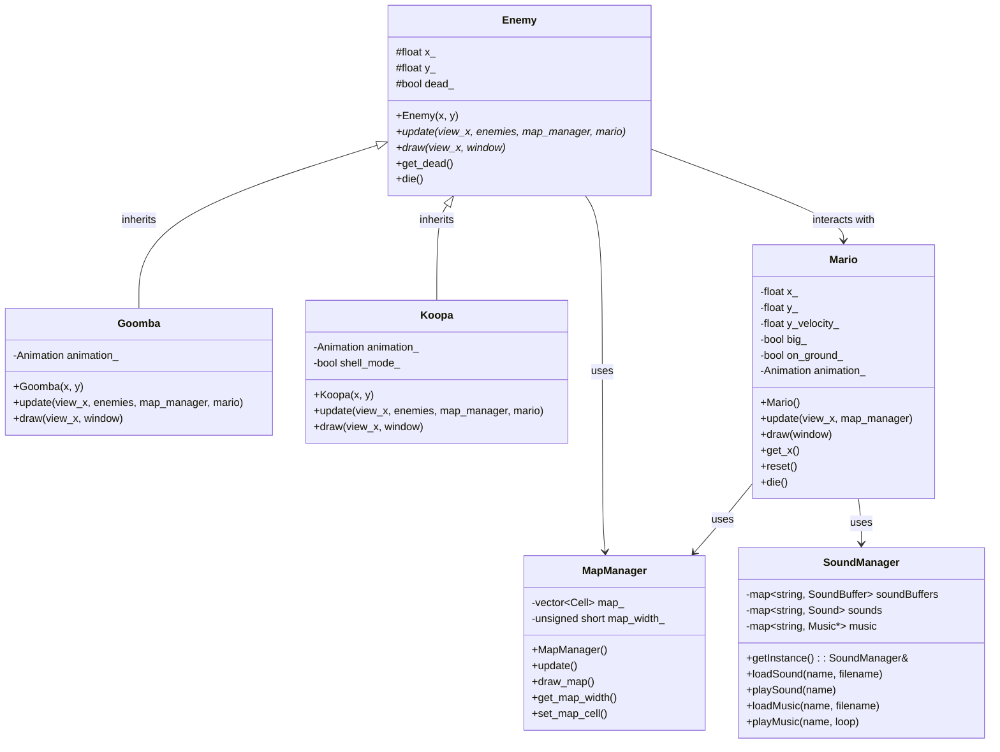

# Super Mario Bros
Remake of the original Super Mario Bros game.

## Features
- Classic Mario gameplay with running and jumping
- Multiple levels with unique designs
- Coin collection
- Block destruction
- Mushroom power-ups that make Mario big
- Enemy interaction (Goombas, Koopas)
- Sound effects and music
- Controller support (Xbox/PlayStation)

## Building the Project

### Prerequisites
- CMake 3.10 or higher
- SFML 2.5 or higher (with graphics, window, system, and audio components)

### Build Instructions

#### Using CMake (Recommended)
1. Clone the repository
```bash
git clone https://github.com/your-username/Super-Mario-Bros.git
cd Super-Mario-Bros
```

2. Create a build directory and navigate to it
```bash
mkdir build
cd build
```

3. Generate build files with CMake
```bash
cmake ..
```

4. Build the project
```bash
cmake --build .
```

5. Run the game
```bash
./mario
```

#### Using g++ directly (Alternative)
```bash
cd Super-Mario-Bros/src
g++ *.cpp -std=c++17 -lsfml-graphics -lsfml-window -lsfml-system -lsfml-audio -o mario
./mario
```

## Controls

### Keyboard
- **Left/Right Arrow**: Move Mario left/right
- **Space**: Jump
- **Enter**: Restart level

### Controller (Xbox/PlayStation)
- **Left Stick/D-pad**: Move Mario left/right
- **A/X Button**: Jump
- **Start Button**: Restart level

## UML Class Diagram



## Sound Effects
The game includes multiple sound effects:
1. Jumping
2. Coin collection
3. Power-up (mushroom)
4. Block breaking
5. Enemy stomping
6. Background music theme

## Original Development Videos
- Part 1: https://youtu.be/7D4uoSoQsjw
- Part 2: https://youtu.be/6SnGgsgV_GY
