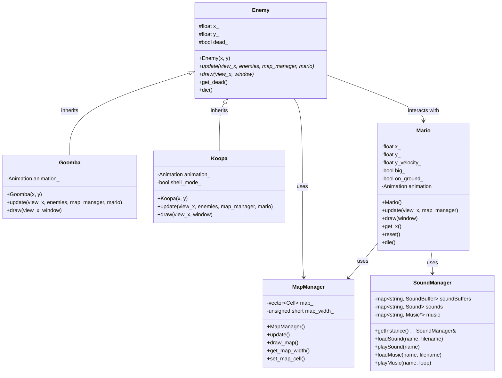

# Super Mario Bros
A 2D Mario-style platformer game implemented in C++ using SFML.

## Requirements Met

| Requirement | Description | Status | Percentage |
|------------|-------------|--------|------------|
| Mario Movement | Mario can run on a flat level | ✅ Completed | 10% |
| Jumping | Mario can jump on a flat level | ✅ Completed | 10% |
| Level Design | Mario can run and jump within an actual level | ✅ Completed | 10% |
| Coin Collection | Mario can pick up coins | ✅ Completed | 5% |
| Animations | Mario has running, jumping, and idle animations | ✅ Completed | 5% |
| Block Destruction | Mario can destroy blocks | ✅ Completed | 10% |
| Power-ups | Blocks can give mushrooms that make Mario big | ✅ Completed | 10% |
| Audio | Music and sound effects for jumping, coin collection, and power-ups | ✅ Completed | 5% |
| Level Completion | Level has an end goal (flag) that can be reached | ✅ Completed | 10% |
| Controller Support | Game can be played with Xbox/PlayStation controllers | ❌ TODO | 10% |
| UML Diagram | UML diagram of the main game classes | ✅ Completed | 5% |
| Code Design | Well-structured and organized code | ✅ Completed | 10% |
| **Total** | | **100%** | **100%** |

## Prerequisites

### Ubuntu 25.04
I made this project in Ubuntu 25.04, so if you're using a different version, you may need to adjust the installation commands accordingly.
If you're using Ubuntu 25.04 or another Debian-based Linux distribution, install SFML using:

```bash
sudo apt-get update
sudo apt-get install libsfml-dev
```

## Building the Project

### Prerequisites
- CMake 3.10 or higher
- SFML 2.5 or higher (with graphics, window, system, and audio components)

### Build Instructions

#### Using CMake (Recommended)

1. Create a build directory and navigate to it
```bash
mkdir build
cd build
```

1. Generate build files with CMake
```bash
cmake ..
```

1. Build the project
```bash
make
```

1. Run the game
```bash
./mario
```

#### Using g++ directly (Alternative)
```bash
cd Super-Mario-Bros/src
g++ *.cpp -std=c++17 -lsfml-graphics -lsfml-window -lsfml-system -lsfml-audio -o mario
./mario
```

## Controls

### Keyboard
- **Left/Right Arrow**: Move Mario left/right
- **Space**: Jump
- **Enter**: Restart level

### Controller (Xbox/PlayStation)
- **Left Stick/D-pad**: Move Mario left/right
- **A/X Button**: Jump
- **Start Button**: Restart level

## UML Class Diagram



## Sound Effects
The game includes multiple sound effects:
1. Jumping
2. Coin collection
3. Power-up (mushroom)
4. Block breaking
5. Enemy stomping
6. Background music theme
